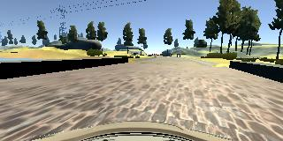
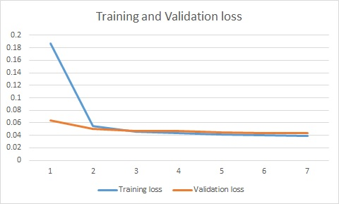

#**Behavioral Cloning** 

##Writeup Template

###You can use this file as a template for your writeup if you want to submit it as a markdown file, but feel free to use some other method and submit a pdf if you prefer.

---

# Behavioral Cloning Project

The goals / steps of this project are the following:
* Use the simulator to collect data of good driving behavior
* Build, a convolution neural network in Keras that predicts steering angles from images
* Train and validate the model with a training and validation set
* Test that the model successfully drives around track one without leaving the road
* Summarize the results with a written report


[//]: # (Image References)

[image1]: ./examples/placeholder.png "Model Visualization"
[image2]: ./examples/placeholder.png "Grayscaling"
[image3]: ./examples/placeholder_small.png "Recovery Image"
[image4]: ./examples/placeholder_small.png "Recovery Image"
[image5]: ./examples/placeholder_small.png "Recovery Image"
[image6]: ./examples/placeholder_small.png "Normal Image"
[image7]: ./examples/placeholder_small.png "Flipped Image"

## Rubric points

Here I will consider the [rubric points](https://review.udacity.com/#!/rubrics/432/view) individually and describe how I addressed each point in my implementation.

### Files Submitted & Code Quality

#### 1. Following files have been included in the submission. 
- model.py : This file contains the python code to read the images to generate the training data, augment the training data, build a training model, and save it in model.h5
- drive.py : This file is used for driving the car in autonomous mode in the simulator. This is provided [Udacity](https://github.com/udacity/CarND-Behavioral-Cloning-P3/blob/master/drive.py). I did not need to make any changes
- model.h5 : This is a generated file that has all the information about the trained network.
- writeup\_report.md : This report
- video.mp4 - This video shows the autonomous driving of the car using my trained model

#### 2. Submission includes functional code Using the Udacity provided simulator and my drive.py file; the car can be driven autonomously around the track by executing

```
Python drive.py model.h5
```

#### 3. Submission code is usable and readable

model.py contains all the code required to train the model. This code has been tested with several data inputs and has found to be robust and usable. Variable names are easily readable and appropriate comments have been added

### Model Architecture and Training Strategy

#### 1. An appropriate model architecture has been employed
Lenet model that I used in Project 2 has been used as a starting point. This models a convolutional neural network with 2 layers of 2D convolution.
Each convolution layer is supported by a relu layer and a max-pooling layer. The convolution layers are followed by a flatten layer, which in turn is followed by three dense layers.
The model has been enhanced further by adding a lambda layer upfront to normalize the input data by mapping values from 0-255 to values from -0.5 to 0.5
Also, a 2D cropping layer has been added to remove crop\_top=70 rows of pixels from the top and crop\_bottom=20 pixels from the bottom

Training was performed using the keras model fit algorithm. Training was done by shuffling the data, and a batch size of 1000 was used. 
Adam classifier was used and mean square error was used to represent error. Training was done for 7 epochs

With my training data and the Lenet model, I found that I was able to achieve very good performance

#### 2. Attempts to reduce overfitting in the model

I used data from two different sources - one provided by Udacity and one that I generated using the simulator. I drove only two laps to capture data in order to avoid to over fitting. I also used different styles of driving while collecting data

#### 3. Model parameter tuning

Learning rate was tuned internally. I tried various batch sizes and found that 1000 is a good number (total number of training data images is around 150000)
Default parameters in the Lenet model generated good results

#### 4. Appropriate training data

I used data from two different sources - one provided by Udacity and one that I generated using the simulator. 
I drove only two laps to capture data in order to avoid to over fitting. 
I also used different styles of driving while collecting data

### Methodology

#### 1. Overview

As a first step, I uses a simple neural network model as proposed in lectures. This model was used to build the overall pipeline. 
Only center images from Udacity provided database with no data augmentation was used. Results were disastrous. Steering angle veered between +25 and -25 degrees and the car went around in circles.

Following steps were then taken to improve results:
1. The simple NN was replaced by a Lenet CNN. Details are mentioned in the next section
2. Additional input data was obtained by using the simulator provided
3. Data was augmented by adding horizontally flipped versions. Also, I used data from all three cameras
4. Various training parameters were used and the best combination was derived upon

I was now able to get the car to drive safely for more than a single lap. There was one instance when the car touches the shoulder, but the model is able to correct itself.

#### 2. Final Model Architecture

The final model architecture (get\_Lenet\_model) consisted of a convolution neural network with the following layers and layer sizes.
This report was obtained using print(model.summary())
```
____________________________________________________________________________________________________
Layer (type)                     Output Shape          Param #     Connected to                     
====================================================================================================
lambda_1 (Lambda)                (None, 160, 320, 3)   0           lambda_input_1[0][0]             
____________________________________________________________________________________________________
cropping2d_1 (Cropping2D)        (None, 70, 320, 3)    0           lambda_1[0][0]                   
____________________________________________________________________________________________________
convolution2d_1 (Convolution2D)  (None, 66, 316, 6)    456         cropping2d_1[0][0]               
____________________________________________________________________________________________________
maxpooling2d_1 (MaxPooling2D)    (None, 33, 158, 6)    0           convolution2d_1[0][0]            
____________________________________________________________________________________________________
convolution2d_2 (Convolution2D)  (None, 29, 154, 6)    906         maxpooling2d_1[0][0]             
____________________________________________________________________________________________________
maxpooling2d_2 (MaxPooling2D)    (None, 14, 77, 6)     0           convolution2d_2[0][0]            
____________________________________________________________________________________________________
flatten_1 (Flatten)              (None, 6468)          0           maxpooling2d_2[0][0]             
____________________________________________________________________________________________________
dense_1 (Dense)                  (None, 120)           776280      flatten_1[0][0]                  
____________________________________________________________________________________________________
dense_2 (Dense)                  (None, 84)            10164       dense_1[0][0]                    
____________________________________________________________________________________________________
dense_3 (Dense)                  (None, 1)             85          dense_2[0][0]                    
====================================================================================================
Total params: 787,891
Trainable params: 787,891
Non-trainable params: 0
____________________________________________________________________________________________________
```


#### 3. Creation of the Training Set & Training Process

I used the sample data provided by Udacity. It has 24108 images captured from the center, left, and right cameras. Steering wheel angles for a given image is also provided.
In addition, I used the driving simulator provided by Udacity to drive the car in the first track in 'training mode'. During the first run, I intentionally kept the car at the very center of the lane.
In the second run, I allowed myself to make a few mistakes and correct them and recorded my images and steering corrections.

#### Sample Data
Here are three examples of images and attributes from my dataset

1. Left turn


<table>
<th>Steering Angle</th><th>Throttle</th><th>Brake</th><th>Speed</th>
<tr><td>-0.9154633</td><td>0.402409</td><td>0.0</td><td>20.12185</td></tr>
</table>

2. Straight



<table>
<th>Steering Angle</th><th>Throttle</th><th>Brake</th><th>Speed</th>
<tr><td>0.0</td><td>0.0</td><td>0.0</td><td>16.79747</td></tr>
</table>


3. Right turn


<table>
<th>Steering Angle</th><th>Throttle</th><th>Brake</th><th>Speed</th>
<tr><td>0.9509109</td><td>0.1172131</td><td>0.0</td><td>7.866938</td></tr>
</table>

Following are few numbers related to data collection:
1. Udacity data - 24108 images
2. My data from run 1 - 19356 images
3. My data from run 2 - 8988 images
4. Total - 52452 images

I also flipped each image horizontally to double the data 

Training was performed using the Lenet CNN model described earlier in the report with the following parameters:
1. number of epochs = 7
2. batch size = 1000
3. Classifier used = Adam
4. Validation split = 80/20
5. Shuffle = True

Following is the trend found in training and validation loss across the 7 epochs



### Discussion and Summary

Following are the salient features of this project:
1. Use of combination of input data - Udacity data + data from my local runs
2. Images for all three cameras are used. A parametric steering correction factor is used to account for
the difference in view angles of left/right cameras
3. All images are flipped horizontally to augment the data further
4. Each image is cropped further to remove unwanted data (sky, hood of the car etc)
5. Pixels are normalized between -0.5 and 0.5
6. Lenet CNN is used
7. Adam optimizer is used to train  the model

Limitations:
1. The design does not use generators. I was able to run the design on a powerful machine with a 
large RAM. So I was able to handle all data being loaded into memory at once
2. I did not use data from the second track
3. I did not try a deeper CNN as I was able to obtain very good performance with Lenet CNN. I focused on data collection and augmentation

Summary:
Using my data and the Lenet model, I was able to drive the car autonomously around the first track once and have provided the trained model and output video with this submission.

